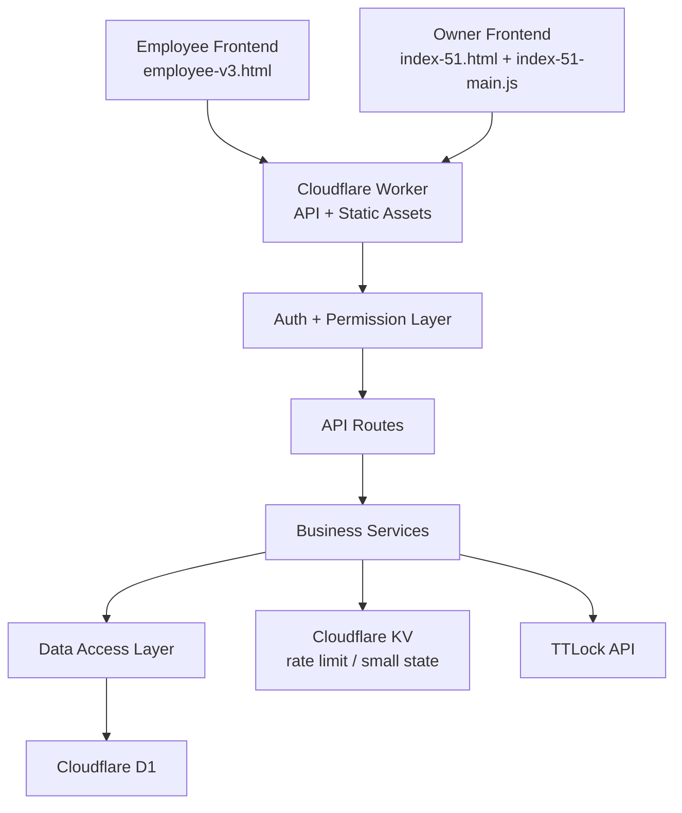
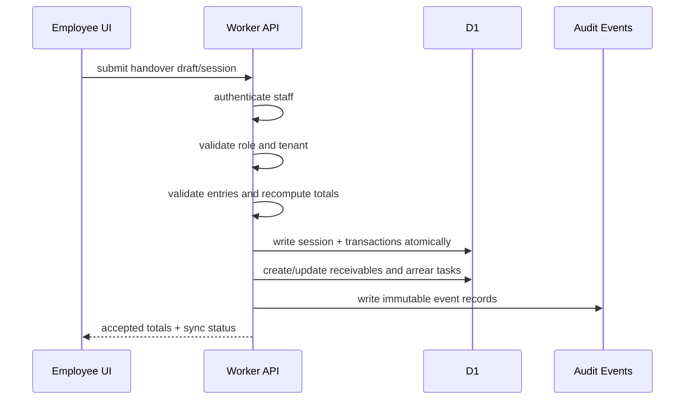
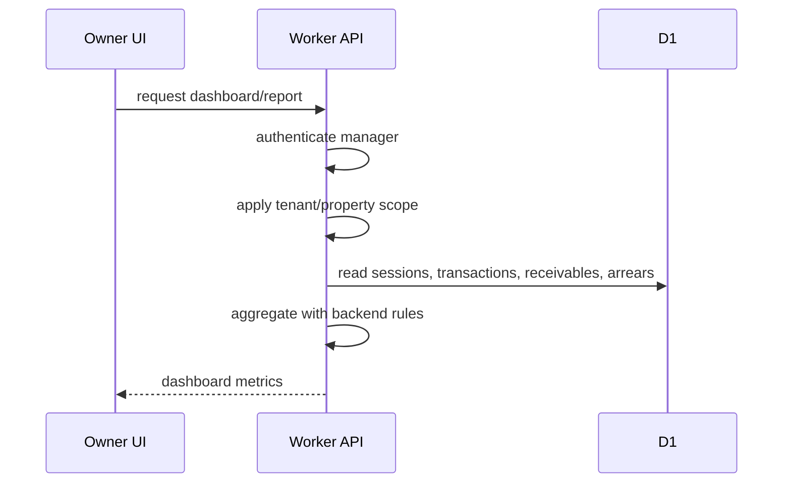
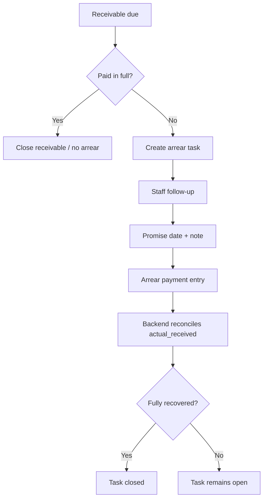

# Homelink Architecture

This document describes the intended commercial architecture. It is not a claim that the current code already fully meets this design. It is the target boundary map for future repair and development.

## System Overview



## Module Boundaries

### Employee Frontend

Purpose:

- fast staff login
- event entry
- rent/arrear/deposit context verification
- arrear follow-up
- handover preview and export

Must not own:

- authoritative financial totals
- permission decisions
- tenant isolation
- final arrear state truth
- rent configuration authority

Employee frontend may keep local drafts, but local drafts are not the accounting source of truth until accepted by the backend.

### Owner Frontend

Purpose:

- business dashboard
- rent configuration
- history review
- customer/credit analysis
- report review
- manager-level correction and void workflows

Must not own:

- raw credential logic
- backend permission logic
- server-side financial truth
- cross-tenant filtering

### Cloudflare Worker

Purpose:

- serve static pages/assets
- authenticate users
- authorize API access
- validate all incoming data
- compute authoritative financial totals
- write D1 transactions
- create audit records
- integrate TTLock and future WiFi/router systems

Worker must be split conceptually into:

- `auth`: login, sessions, password verification, rate limiting
- `middleware`: origin/CORS/security headers/auth requirement
- `routes`: request routing only
- `services`: financial and business rules
- `repositories`: D1 reads/writes
- `integrations`: TTLock, future router/WiFi integrations
- `audit`: immutable events and activity logs

### Database Layer

Purpose:

- durable accounting records
- tenant-scoped source of truth
- audit trail
- configuration history
- reporting material

Database writes must be performed through server-side validation and service logic.

## Data Flow

### Employee Entry Flow



Target rule:

- A whole handover should be accepted or rejected as a unit.
- If partial upload is temporarily supported, the partial state must be explicit, recoverable, and audit-visible.

### Owner Dashboard Flow



Target rule:

- Owner dashboard metrics should be generated by backend or from backend-normalized data.
- Browser-side analysis can exist for UX, but cannot be the only financial truth.

### Arrear Follow-Up Flow



Target rule:

- Arrear amount must be linked to an originating receivable or transaction.
- Repayment must reduce the exact task, not a free text amount.

## API Layer

API route categories:

- `/auth/*`: login/logout/session creation
- `/api/me`: current authenticated user
- `/api/employee/*`: staff execution APIs
- `/api/*`: manager APIs
- `/api/lock/*`: TTLock card context
- `/api/wifi/*`: future router/WiFi state

API requirements:

- all write requests must verify trusted origin
- all protected routes must require authenticated session
- all manager routes must enforce manager role in backend
- staff APIs must use an allowlist
- all write requests must create audit records
- validation errors must be explicit and user-safe

## Permission Layer

Roles:

- `staff`: entry, own handover, assigned arrear follow-up, limited context
- `manager`: all company/property business data, configuration, report, void approval
- `admin`: future platform-level operations, not normal business use

Permission rules:

- Frontend visibility is convenience only.
- Backend authorization is mandatory.
- Staff cannot alter configured rent, historical totals, owner notes, or close/write-off arrears without manager authority.
- Manager corrections must be audited and should not overwrite original facts without an event trail.

## Worker Structure Target

Current state:

- Worker business logic is mostly in `deploy-worker/src/index.js`.
- Production embedded Worker is generated into `deploy-worker/src/index.embedded.js`.

Target structure:

```text
deploy-worker/
  src/
    index.js
    auth/
    middleware/
    routes/
    services/
      finance/
      arrears/
      deposits/
      handover/
    repositories/
    integrations/
      ttlock/
      wifi/
    audit/
  public/
    employee/
    owner/
  migrations/
  tests/
```

Migration to this structure must be incremental. Do not perform a large rewrite unless specifically approved.

## Backend Authority Rules

The backend must be authoritative for:

- amount normalization
- handover totals
- arrear creation/reconciliation
- deposit balance
- role/tenant scope
- audit log creation
- soft deletion/voiding

The frontend may assist with:

- faster data entry
- display formatting
- local draft recovery
- preview before submit
- bilingual UI

## Known Architecture Gaps

- Large monolith files still exist.
- Amount model currently uses decimal numbers in several places.
- Local development environment is not fully documented.
- The current D1 migration chain is incomplete for a clean database.
- Some owner-side calculations still run primarily in browser code.
- Employee handover upload is not yet a fully atomic session submission.
