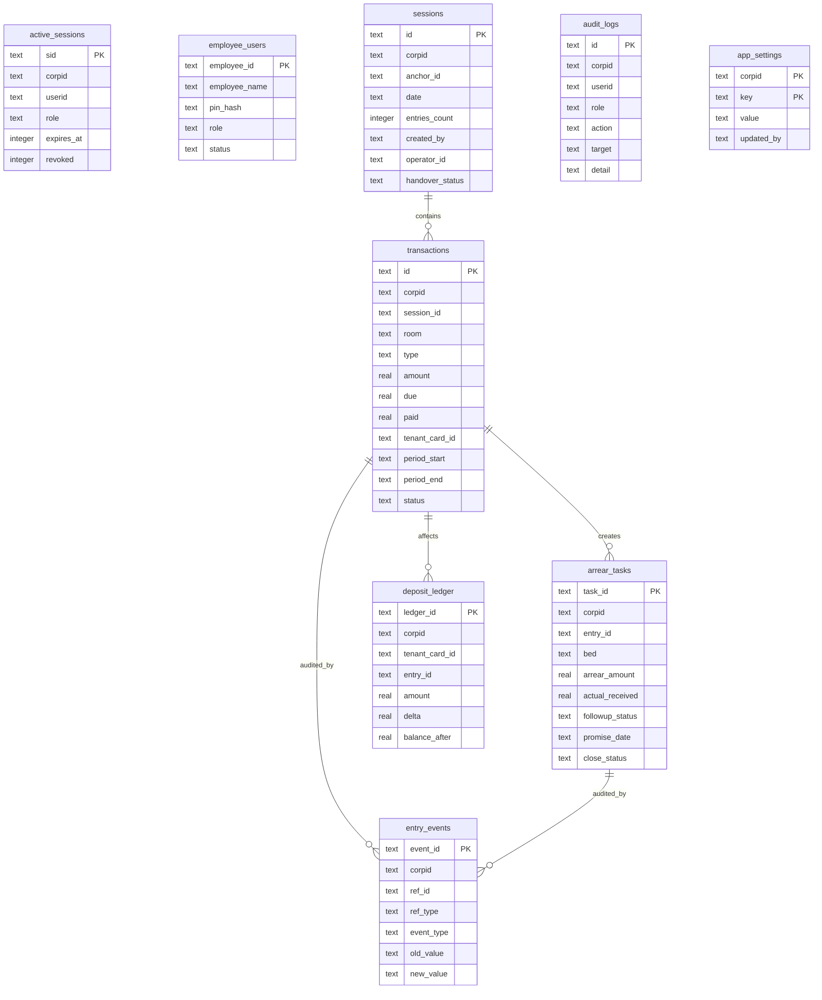

# Homelink Project Map

This map records where the current project lives, how it is served, and which files are entry points. Keep it updated whenever structure changes.

## Project Root

```text
C:\Users\Chinalink\Desktop\软件迭代
```

## Main Entrypoints

### Employee Frontend

Source/current working file:

```text
C:\Users\Chinalink\Desktop\软件迭代\employee-v3.html
```

Deployed static asset copy:

```text
C:\Users\Chinalink\Desktop\软件迭代\deploy-worker\public\employee-v3.html
```

URL:

```text
https://homelink-finance.habibramadan888.workers.dev/employee-v3.html
```

Purpose:

- staff login
- event entry
- TTLock context lookup
- arrear follow-up
- TXT handover/export

### Owner Frontend

HTML source:

```text
C:\Users\Chinalink\Desktop\软件迭代\index-51.html
```

Main JavaScript:

```text
C:\Users\Chinalink\Desktop\软件迭代\index-51-main.js
```

Deployed public copies:

```text
C:\Users\Chinalink\Desktop\软件迭代\deploy-worker\public\index-51.html
C:\Users\Chinalink\Desktop\软件迭代\deploy-worker\public\index-51-main.js
```

URL:

```text
https://homelink-finance.habibramadan888.workers.dev/
https://homelink-finance.habibramadan888.workers.dev/index-51.html
```

Purpose:

- owner login
- dashboard
- history
- analysis
- customer credit
- rent configuration
- TTLock/WiFi management

### Cloudflare Worker

Worker project:

```text
C:\Users\Chinalink\Desktop\软件迭代\deploy-worker
```

Source Worker:

```text
C:\Users\Chinalink\Desktop\软件迭代\deploy-worker\src\index.js
```

Embedded production Worker:

```text
C:\Users\Chinalink\Desktop\软件迭代\deploy-worker\src\index.embedded.js
```

Asset embedding script:

```text
C:\Users\Chinalink\Desktop\软件迭代\deploy-worker\scripts\build-embedded-worker.js
```

## Cloudflare Structure

Worker name:

```text
homelink-finance
```

Production URL:

```text
https://homelink-finance.habibramadan888.workers.dev
```

Primary config with Workers Assets:

```text
C:\Users\Chinalink\Desktop\软件迭代\deploy-worker\wrangler.toml
```

Embedded config:

```text
C:\Users\Chinalink\Desktop\软件迭代\deploy-worker\wrangler.embedded.toml
```

D1 binding:

```text
binding = "DB"
database_name = "homelink"
database_id = "562aa079-1cca-4176-ba3b-7276a65f98fb"
```

KV binding:

```text
binding = "RATE_LIMIT"
id = "c7c64d522d964baba2e72454e7262da9"
```

Current static assets directory:

```text
C:\Users\Chinalink\Desktop\软件迭代\deploy-worker\public
```

## Environment Variables And Secrets

Visible vars in Wrangler config:

```text
APP_NAME = "Homelink Finance"
APP_VERSION = "2.0.0"
CORPID = "homelink"
```

Required secrets/config for commercial operation:

```text
JWT_SECRET
PW_SALT
MANAGER_PW_HASH
STAFF_PW_HASH or USER_ACCOUNTS
DATA_ENCRYPTION_KEY
TTLOCK_CLIENT_ID
TTLOCK_CLIENT_SECRET
TTLOCK_USERNAME
TTLOCK_PASSWORD
TTLOCK_API_ORIGIN
ALLOWED_ORIGINS
ALLOWED_HOST
CLOUD_API_ORIGIN
```

Local development requirement:

- A `.dev.vars.example` should be added before commercial handoff.
- Real `.dev.vars` and production secrets must not be committed.

## Database Relationship Map

Current/observed tables and target responsibilities:



Important current risk:

- Some tables may be created only at runtime or assumed to already exist.
- Clean database bootstrap is not yet proven complete.
- Several money columns are currently `REAL`; target model should use integer minor units.

## API Map

Authentication:

```text
POST /auth/login
POST /auth/employee-login
POST /auth/logout
GET  /api/me
```

Employee APIs:

```text
GET  /api/employee/session
GET  /api/employee/lock/cards
GET  /api/employee/deposit
POST /api/employee/entry
GET  /api/employee/arrears
POST /api/employee/arrear_task
POST /api/employee/migrate
```

Owner/manager APIs:

```text
GET  /api/lock/cards
GET  /api/rent_config
POST /api/rent_config
GET  /api/wifi/accounts
POST /api/wifi/accounts
GET  /api/customers
POST /api/customers
POST /api/save_session
POST /api/delete_session
POST /api/clear_arrear
GET  /api/history
GET  /api/session_detail
```

## Deployment Notes

Observed local commands:

```text
npx wrangler dev --config wrangler.toml --port 8791
npx wrangler dev --config wrangler.embedded.toml --port 8792
npx wrangler deploy --config wrangler.toml --dry-run --outdir <dir>
npx wrangler deploy --config wrangler.embedded.toml --dry-run --outdir <dir>
```

Production deployment must use documented secrets and should not rely on local hidden state.

## Documentation Map

Governance:

```text
AI_CONTRACT.md
ARCHITECTURE.md
PROJECT_MAP.md
```

Existing docs:

```text
DEPLOY_EMPLOYEE.md
employee-api-contract.md
entry-logic-final.md
```

Known documentation risk:

- Some existing docs may be stale or contain encoding corruption.
- Governance documents should be treated as the current engineering authority until a full documentation cleanup is completed.
