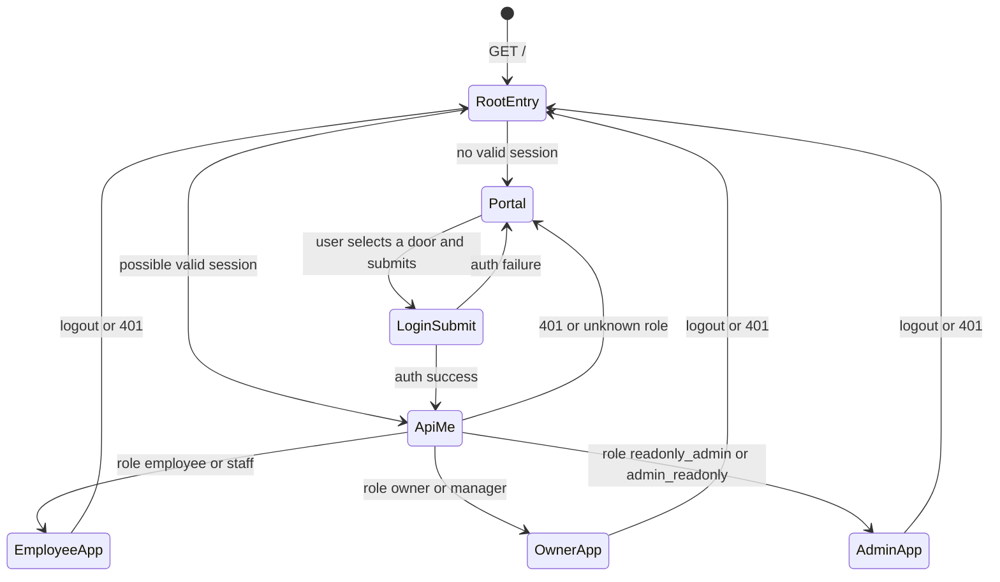

# Final Architecture: One Entry, Three Doors

Scope: target architecture plus current non-compliance audit. No code changes were made.

## Entry Point

Formal public entry:

```text
https://homelink-finance.habibramadan888.workers.dev/
```

Flow:

1. User opens `/`.
2. Worker serves the three-door portal (`/portal` asset).
3. If the user is already authenticated, the front end calls `/api/me` and routes by server role.
4. If the user is unauthenticated, the portal shows three choices:
   - employee
   - owner
   - admin
5. Login submits credentials to the auth endpoint.
6. Server sets an `HttpOnly`, `Secure`, `Path=/`, `SameSite=Strict` session cookie.
7. Front end calls `/api/me` after login and routes by server role only.

## State Machine



## Old Path Compatibility

| Path                                                | Current Behavior                                                                       | Target Behavior                       | Current Compliance |
| --------------------------------------------------- | -------------------------------------------------------------------------------------- | ------------------------------------- | ------------------ |
| `/`                                                 | Serves portal through `handleAppEntryRoute()` and `fetchStaticAsset(..., "/portal")`.  | Formal entry.                         | COMPLIANT          |
| `/home`                                             | Serves portal.                                                                         | Optional alias.                       | ACCEPTABLE         |
| `/login`                                            | Redirects to `/`.                                                                      | Redirect to `/`.                      | COMPLIANT          |
| `/unified-login.html`                               | Redirects to `/` at Worker route level. Physical static file remains.                  | Redirect to `/`; not a product entry. | PARTIAL            |
| `/employee-login`, `/staff-login`, `/employee.html` | Redirects to `/?portal=employee`.                                                      | Compatibility alias only.             | COMPLIANT          |
| `/owner-login`                                      | Redirects to `/?portal=owner`.                                                         | Compatibility alias only.             | COMPLIANT          |
| `/admin-login`                                      | Redirects to `/?portal=admin`.                                                         | Compatibility alias only.             | COMPLIANT          |
| `/employee-v3.html`, `/employee-v2.html`            | Redirects to `/employee`.                                                              | Compatibility alias only.             | COMPLIANT          |
| `/index.html`, `/index-51.html`                     | Redirects to `/owner`.                                                                 | Compatibility alias only.             | COMPLIANT          |
| `/employee`                                         | Requires route claim; staff/employee allowed.                                          | Employee business page.               | COMPLIANT          |
| `/owner`                                            | Requires route claim; owner/manager allowed.                                           | Owner business page.                  | COMPLIANT          |
| `/admin`                                            | Requires route claim; readonly admin allowed and served owner shell in read-only mode. | Admin read-only page.                 | PARTIAL            |

## Route Guards

Current Worker guard source: `deploy-worker/src/index.js` `handleAppEntryRoute()` and `readRouteClaim()`.

```javascript
const routeGuards = {
  "/employee": {
    requiredRoles: ["employee", "staff"],
    unauthenticated: "/",
    wrongRole: "server_role_destination"
  },
  "/owner": {
    requiredRoles: ["owner", "manager"],
    unauthenticated: "/",
    wrongRole: "server_role_destination"
  },
  "/admin": {
    requiredRoles: ["readonly_admin", "admin_readonly"],
    unauthenticated: "/",
    wrongRole: "server_role_destination"
  },
  "/": {
    public: true,
    authenticatedFallback: "server_role_destination"
  }
};
```

Rules:

1. The selected door changes login form UX only.
2. The selected door does not grant authority.
3. `/api/me` and verified server session are authority.
4. Stale `localStorage` role values must be ignored.
5. Business pages show loading until auth check completes.
6. Unknown role returns to `/` with a minimal error.

## Permission Decision Tree

```text
request /employee
  has valid server session?
    no  -> redirect /
    yes -> /api/me or verified JWT role
      role in [employee, staff] -> serve employee page
      role in [owner, manager] -> redirect /owner
      role in [readonly_admin, admin_readonly] -> redirect /admin
      unknown -> redirect /

request /owner
  has valid server session?
    no  -> redirect /
    yes -> /api/me or verified JWT role
      role in [owner, manager] -> serve owner page
      role in [readonly_admin, admin_readonly] -> redirect /admin
      role in [employee, staff] -> redirect /employee
      unknown -> redirect /

request /admin
  has valid server session?
    no  -> redirect /
    yes -> /api/me or verified JWT role
      role in [readonly_admin, admin_readonly] -> serve read-only owner shell
      role in [owner, manager] -> redirect /owner
      role in [employee, staff] -> redirect /employee
      unknown -> redirect /
```

## Logout / Lock Icon Flow

Target implementation:

```javascript
async function handleLogout() {
  clearLegacyAuthStorage();
  await fetch("/auth/logout", {
    method: "POST",
    credentials: "include"
  });
  window.location.href = "/";
}
```

Allowed local storage after logout:

- remembered username only, if the user explicitly enabled it.

Forbidden local storage after logout:

- role
- token
- user authority
- owner role cache
- employee role cache
- session authority

## Current Non-Compliance Checklist

| Check                                              | Current Finding                                                                               | Status                | Required Follow-up                                                           |
| -------------------------------------------------- | --------------------------------------------------------------------------------------------- | --------------------- | ---------------------------------------------------------------------------- |
| `/unified-login.html` directly accessible          | Worker redirects it to `/`, but physical file still exists.                                   | PARTIAL               | Keep redirect and remove asset or mark as compatibility-only in asset build. |
| `/employee-v3.html` directly accessible            | Worker redirects to `/employee`.                                                              | PASS                  | Keep regression test.                                                        |
| `/index.html` directly accessible                  | Worker redirects to `/owner`.                                                                 | PASS                  | Keep regression test.                                                        |
| `localStorage.getItem("role")` used for permission | Current grep shows legacy role keys are cleared; authority decisions use server route claim.  | PASS_WITH_COMPAT_RISK | Continue removing compatibility bearer token and stale role key references.  |
| logout returns to `/`                              | Portal, owner, and employee shell point to `/` via `UNIFIED_LOGIN_DESTINATION="/"`.           | PASS                  | Keep lock-icon regression tests.                                             |
| old employee PIN login visible                     | Employee shell redirects unauthenticated users to `/`; old overlay is hidden for normal flow. | PASS_WITH_COMPAT_RISK | Remove fallback UI from user-visible path.                                   |
| old owner login visible                            | Owner fallback redirects to `/` and suppresses old login panel.                               | PASS_WITH_COMPAT_RISK | Keep source and browser-level flash tests.                                   |
| employee name displays `staff`                     | Employee display helper filters `staff` and prefers identity fields.                          | PASS                  | Require `/api/me` identity fields for all employee accounts.                 |
| admin can write owner data                         | Server `canWriteOwnerData()` is true only for manager; `/api/me` returns `canWrite`.          | PASS_WITH_AUDIT_GAP   | Audit all write endpoints for `requireManager()` or equivalent.              |
| unauthenticated `/employee` redirects to `/`       | Implemented by route guard.                                                                   | PASS                  | Keep route-normalization test.                                               |

## Implementation Checklist For Future Work

1. Remove user-visible legacy login assets or keep hard redirects at Worker level.
2. Freeze `/api/me` schema to include `permissions`, `tenant_id`, and `allowed_property_ids`.
3. Delete all permission-bearing localStorage usage; keep only remembered username.
4. Centralize logout in one helper used by all lock icons.
5. Add browser-level tests for redirect flicker and back-button behavior.
6. Keep production status `PRODUCTION_NO_GO` until tenant and finance gates pass.
