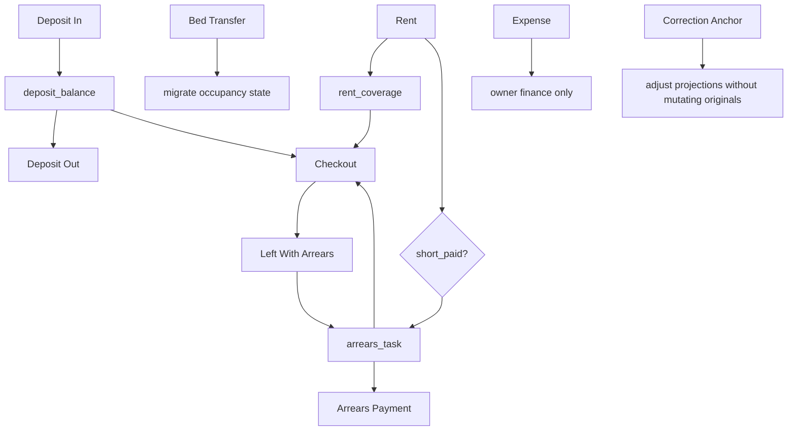

# Employee 7 Event Business Dependency And Anchor Model V1

Status: planning and audit only. No runtime code changed. No production data changed. No deploy. No migration. No fake production records. Production cutover = PRODUCTION_NO_GO.

This document defines the business logic, dependency graph, input anchors, output anchors, state projections, forbidden identity boundaries, and final target model for the seven employee Entry event types:

1. Rent
2. Arrears Payment
3. Deposit In
4. Deposit Out
5. Checkout
6. Expense
7. Bed Transfer

Closed-loop testing should not proceed until this model is reviewed and accepted.

## Core Business Objects

### occupancy_session

Meaning: one continuous customer stay relationship.

Rules:

- A customer stay can move between beds.
- A customer stay can change card/access context.
- Bed, card, phone, card_id, tenant_card_id, provider phone, and 99099 phone are not durable customer identity.
- Financial life can remain open after the bed is released, for example left_with_arrears.
- Future durable identifier: occupancy_session_id.
- Transitional identifier: occupancy_candidate_id.

### bed

Meaning: a physical location. Bed is context for current operations, not customer identity.

Rules:

- A bed can host different customer stays over time.
- A bed can be released by checkout or bed transfer.
- Events linked only by bed are not enough for debt/deposit identity when the customer has left or transferred.

### rent_coverage

Meaning: the paid-for stay period.

Rules:

- Created or updated by Rent.
- Carried by Bed Transfer.
- Considered during Checkout.
- Does not equal access card validity unless explicitly reconciled.

### arrears_task

Meaning: open debt generated by short-paid rent, left-with-arrears, or another approved arrears source.

Rules:

- Must have arrears_ref.
- Must be settled by explicit Arrears Payment or approved correction/waiver.
- Must not be inferred from future rent receivables.
- Must not be linked by bed only after customer leaves or bed changes.

### deposit_balance

Meaning: deposit liability owed back to the customer unless deducted, offset, refunded, or corrected.

Rules:

- Created or increased by Deposit In.
- Reduced by Deposit Out, approved arrears offset, checkout deduction, or correction.
- Not rent income.
- Carried by Bed Transfer for the same occupancy_session.

### access_snapshot

Meaning: access card / card remark business context.

Rules:

- Context only, not customer identity.
- May help the employee identify current bed/card context.
- Provider fields must remain non-authoritative.
- User-visible wording should use Access Card, not supplier branding.

### financial_ledger_event

Meaning: cash, bank, income, refund, expense, liability, or adjustment effect.

Rules:

- Must be generated from structured anchors.
- Must not be derived from free-text export as source of truth.
- Must be correction-aware without mutating original event facts.

### correction_anchor

Meaning: immutable additive correction, void, reversal, or waiver event.

Rules:

- Does not silently mutate original facts.
- Must reference original_event_id or another explicit authoritative anchor.
- Must define financial_effect when it changes totals.
- Must preserve original rows as audit evidence.

## Dependency Graph

Plain-language dependencies:

- Rent -> Arrears Task -> Arrears Payment.
- Deposit In -> Deposit Balance -> Deposit Out.
- Rent + Arrears + Deposit -> Checkout.
- Checkout + unpaid arrears -> Left With Arrears.
- Bed Transfer -> migrate occupancy state.
- Expense -> owner finance only.
- Correction Anchor -> adjusts projections without mutating originals.

## State Projection Matrix

| Event | owner finance | cash/bank total | rent income | deposit liability | arrears state | rent coverage | occupancy state | bed availability | access/network future state | owner history | correction readiness |
|---|---|---|---|---|---|---|---|---|---|---|---|
| Rent | creates | creates | creates | no effect unless deposit included by explicit anchor | creates if short-paid, otherwise no effect | creates/updates | updates context | no effect | context only | creates | creates source event |
| Arrears Payment | creates | creates | no effect | no effect unless explicit offset | updates/closes | no effect | updates financial state | no effect | context only | creates | creates source event |
| Deposit In | creates liability event | creates | no effect | creates/updates | no effect | no effect | updates financial state | no effect | context only | creates | creates source event |
| Deposit Out | creates refund event | updates | no effect | updates/closes | context/updates if explicit offset | no effect | updates financial state | no effect | context only | creates | creates source event |
| Checkout | creates closeout event | updates if refund/deduction/payment | no effect unless explicit linked payment | updates/closes if refund/deduction | updates/context; may create left_with_arrears | closes current coverage context | closes or leaves financially open | updates/releases | future phase | creates | creates source event |
| Expense | creates expense event | updates | no effect | no effect | no effect unless explicitly linked | no effect | no effect | no effect | no effect | creates | creates source event |
| Bed Transfer | creates transfer event | updates if fee paid | no effect unless explicit fee income classification | carries | carries | carries | updates/migrates | updates old/new bed timing | future phase | creates | creates source event |

## Information Anchor Matrix

Required common fields for all events:

- event_id
- event_type
- bed or target_bed / room, with Bed Transfer using from_bed and to_bed
- occupancy_candidate_id if available
- amount or event-specific amount field
- payment_method if money moves
- source_fingerprint
- canonical_fingerprint
- original_event_id if applicable
- correction metadata if applicable
- operator
- created_at
- source = employee_entry

| Event | Required event-specific anchor fields |
|---|---|
| Rent | bed, expected_rent, paid_amount, rent_period_start, rent_period_end, payment_method, short_paid, arrears_amount, arrears_due_date, arrears_note, arrears_status, arrears_ref if short-paid creates debt |
| Arrears Payment | bed, arrears_ref, original_event_id or original_arrears_id, original_arrears_amount, already_paid_amount, remaining_arrears_before, payment_amount, remaining_arrears_after, settlement_status, payment_method |
| Deposit In | bed, deposit_ref if available, deposit_amount, payment_method, deposit_paid_with_rent flag if applicable, note |
| Deposit Out | bed, deposit_ref, deposit_balance_before, refund_amount, deduction_amount, deduction_reason, difference_reason, refund_method, refund_date, deposit_balance_after, owner_override_ref if over balance |
| Checkout | bed, checkout_date, checkout_type, deposit_balance, deposit_refund_amount, outstanding_arrears, owner_approval_required, owner_approval_status, left_with_arrears fields if applicable |
| Expense | target_bed or room, expense_amount, expense_category, reason, payment_method, evidence_ref if available, note |
| Bed Transfer | from_bed, to_bed, transfer_date, fee_amount, fee_status, fee_payment_method, waiver_reason if waived, transfer_reason, old_context_snapshot, new_context_snapshot |

## Forbidden Identity Rules

The following must never be used as customer identity for any of the seven event types:

- card_id
- tenant_card_id
- old_ttlock_ref
- provider phone
- 99099 phone
- card owner account phone

Allowed authoritative or transitional linking fields:

- event_id
- original_event_id
- arrears_ref
- deposit_ref
- occupancy_session_id future
- occupancy_candidate_id transitional
- bed as context only
- access remark as context only

## Event Models

### 1. Rent

Business meaning: record rent received for a defined rent coverage period.

Required variants:

- Normal full rent: expected_rent equals paid_amount and no arrears_task is created.
- Short-paid rent: paid_amount is less than expected_rent and an arrears_task is created for the difference.

Preconditions:

- Bed context exists or is manually entered.
- Expected rent is known or confirmed.
- Rent period start/end is known.
- Payment method is selected.

Required employee input fields:

- bed
- expected_rent
- paid_amount
- payment_method
- rent_period_start
- rent_period_end
- short-paid due date if paid_amount < expected_rent

Optional fields:

- note
- arrears_note
- deposit_included_amount only if explicit deposit component exists

Forbidden identity fields:

- card_id, tenant_card_id, provider phone, 99099 phone, card owner account phone.

Created anchor fields:

- common fields
- expected_rent
- paid_amount
- rent_period_start
- rent_period_end
- payment_method
- short_paid
- arrears_amount if short-paid
- arrears_ref if arrears_task is created

Financial effect:

- paid_amount increases cash or bank receipts.
- rent income equals paid rent component.
- deposit component is not rent income and must be separately anchored if present.

Projection effect:

- Updates rent_coverage.
- Creates arrears_task when short_paid = true.
- Updates owner finance.

Downstream dependencies:

- Arrears Payment depends on arrears_ref from short-paid rent.
- Checkout eligibility depends on open arrears and rent coverage.
- Bed Transfer carries rent coverage forward.

Invalid/rejected cases:

- Missing bed.
- Missing rent period.
- paid_amount < expected_rent without short-paid arrears fields.
- Duplicate rent for same canonical fingerprint unless explicitly separate session/event.
- Payment method missing for paid amount.

Duplicate guard rules:

- Guard by canonical_fingerprint / event identity, not by bed alone.
- Duplicate rent rows must not auto-close arrears.
- Mixed duplicate batches should reject before writing.

Correction/void/reversal requirements:

- Duplicate rent must be corrected by correction_anchor.
- Original rent row remains visible.
- Rent financial deltas must be explicit.

Owner History representation:

- Show bed, paid amount, expected amount, short-paid amount if any, payment method, period, and note.

WhatsApp/compiler future representation:

- Compile from structured anchor, not handwritten free text.
- Short-paid output includes amount, due date, and note.

Access/network/door-card implications:

- Access snapshot is context only.
- Rent coverage may inform future access/network review but must not silently extend access.

Final target:

- Accurate finance, rent coverage, optional arrears_task, owner-visible event, and correction-ready anchor.

### 2. Arrears Payment

Business meaning: record a payment against an existing arrears_task.

Required variants:

- Full or partial repayment must be decided from arrears_ref, remaining_arrears_before, payment_amount, and remaining_arrears_after.
- Full repayment: payment_amount clears remaining_arrears and settlement_status becomes settled.
- Partial repayment: payment_amount reduces remaining_arrears and settlement_status remains partial.
- Overpayment handling: payment_amount above remaining_arrears is rejected unless an explicit owner-approved overpayment path exists.

Preconditions:

- arrears_ref exists.
- arrears_task status is open or partial.
- Payment amount is entered.

Required employee input fields:

- bed as context
- arrears_ref selected from Cloud Arrears Projection or durable arrears source
- payment_amount
- payment_method

Optional fields:

- note

Forbidden identity fields:

- card_id, tenant_card_id, provider phone, 99099 phone, card owner account phone.

Created anchor fields:

- common fields
- arrears_ref
- original_event_id or original_arrears_id
- original_arrears_amount
- already_paid_amount
- remaining_arrears_before
- payment_amount
- remaining_arrears_after
- settlement_status = partial or settled

Financial effect:

- payment_amount increases cash or bank receipts.
- Does not create rent income.
- Reduces arrears balance.

Projection effect:

- Updates or closes arrears_task.
- May unblock Checkout or Deposit Out.

Downstream dependencies:

- Checkout/deposit release depends on no open/partial arrears unless owner approval or Left With Arrears path exists.

Invalid/rejected cases:

- Missing arrears_ref.
- Linking by bed only.
- Already-settled or void arrears_ref.
- Overpayment without owner-approved handling.
- Binding to rent period.

Duplicate guard rules:

- Duplicate repayment should be guarded by canonical_fingerprint and arrears_ref.
- Same payment cannot settle the same arrears_ref twice.

Correction/void/reversal requirements:

- Incorrect repayment requires correction_anchor.
- Reversal reopens or adjusts arrears projection without mutating original repayment.

Owner History representation:

- Show bed, arrears_ref, original amount, payment amount, remaining before/after, settlement status, and payment method.

WhatsApp/compiler future representation:

- `[bed] arrears paid amount method time note`.

Access/network/door-card implications:

- No direct access effect.
- May clear financial block for future checkout/deposit release.

Final target:

- Explicit, ref-linked debt settlement with no bed-only matching.

### 3. Deposit In

Business meaning: record deposit received as a liability owed back to the customer.

Preconditions:

- Occupancy context exists or can be created.
- Bed context exists.
- Deposit amount and payment method are known.

Required employee input fields:

- bed
- deposit_amount
- payment_method

Optional fields:

- note
- deposit_paid_with_rent flag
- linked rent event if paid with rent

Forbidden identity fields:

- card_id, tenant_card_id, provider phone, 99099 phone, card owner account phone.

Created anchor fields:

- common fields
- deposit_ref if available
- deposit_amount
- payment_method
- occupancy_candidate_id if available
- deposit_paid_with_rent flag if applicable

Financial effect:

- Increases cash/bank receipts.
- Creates deposit liability.
- Cannot be treated as rent income.

Projection effect:

- Creates or increases deposit_balance.

Downstream dependencies:

- Deposit Out and Checkout depend on deposit_balance.
- Bed Transfer carries deposit_balance for the same occupancy_session.

Invalid/rejected cases:

- Missing bed.
- Missing amount.
- Missing payment method.
- Treating deposit as rent income without explicit split anchor.

Duplicate guard rules:

- Guard duplicate deposit by canonical_fingerprint, deposit_ref if available, and source event identity.

Correction/void/reversal requirements:

- Incorrect deposit amount requires correction_anchor.
- Reversal must adjust deposit_balance through projection, not mutate original.

Owner History representation:

- Show bed, deposit amount, payment method, and note.

WhatsApp/compiler future representation:

- `[bed] deposit amount method time note`.

Access/network/door-card implications:

- No direct access effect.

Final target:

- Durable deposit liability created and owner-visible, with no rent income contamination.

### 4. Deposit Out

Business meaning: record a deposit refund, deduction, or offset.

Preconditions:

- deposit_balance exists or is marked needs review.
- Open arrears check is complete.
- Refund amount and method are known.

Required employee input fields:

- bed
- refund_amount
- refund_method
- refund_date
- refund_reason
- difference_reason if actual refund differs from deposit balance

Optional fields:

- deduction_amount
- deduction_reason
- note
- owner_override_ref

Forbidden identity fields:

- card_id, tenant_card_id, provider phone, 99099 phone, card owner account phone.

Created anchor fields:

- common fields
- deposit_ref
- deposit_balance_before
- refund_amount
- deduction_amount
- deduction_reason
- difference_reason
- refund_method
- refund_date
- deposit_balance_after
- outstanding_arrears
- owner_override_ref if refund exceeds balance

Financial effect:

- Refund reduces cash/bank.
- Reduces or closes deposit liability.
- Deduction/offset must be explicit.

Projection effect:

- Updates deposit_balance.
- May update arrears state only if explicit offset anchor exists.

Downstream dependencies:

- Checkout may depend on deposit refund/deduction.
- Arrears offset depends on explicit arrears_ref, not bed only.

Invalid/rejected cases:

- Refund more than deposit_balance without owner override.
- Missing difference_reason when refund_amount differs from deposit_balance.
- Open/partial arrears without approved offset or owner approval.
- Missing refund method.

Duplicate guard rules:

- Guard duplicate refund by canonical_fingerprint and deposit_ref.

Correction/void/reversal requirements:

- Incorrect refund/deduction requires correction_anchor.
- Reversal restores deposit_balance projection without mutating original.

Owner History representation:

- Show refund amount, deposit balance before/after, deduction, reason, method, and arrears/owner approval status.

WhatsApp/compiler future representation:

- Deposit refund/deduction line from structured anchor.

Access/network/door-card implications:

- No direct access effect.

Final target:

- Clear deposit liability update with explicit reasons and owner-safe blocking when arrears exist.

### 5. Checkout

Business meaning: record customer leaving the bed, with financial closeout or left-with-arrears state.

Required variants:

- Normal checkout: no open arrears and no unresolved owner approval requirement.
- Checkout with deposit refund: deposit refund is explicit and linked to deposit_balance.
- Checkout with deduction: deduction amount and deduction reason are explicit.
- Checkout with unpaid arrears: normal checkout is blocked unless owner approval or Left With Arrears path is selected.
- Left With Arrears: customer has left, arrears remains open, and tracking fields are preserved.

Preconditions:

- Bed context exists.
- Open arrears check is complete.
- Deposit balance context is available or marked needs review.
- Checkout type is selected.

Required employee input fields:

- bed
- checkout_date
- checkout_type
- note
- for left_with_arrears: whatsapp_phone, left_date, promised_payment_date, belongings_held, belongings_note if held, left_arrears_amount

Optional fields:

- deposit_refund_amount
- deduction_amount
- deduction_reason
- confirmed_not_returning_date
- promised_return_date

Forbidden identity fields:

- card_id, tenant_card_id, provider phone, 99099 phone, card owner account phone.

Created anchor fields:

- common fields
- checkout_date
- checkout_type
- deposit_balance
- deposit_refund_amount
- outstanding_arrears
- owner_approval_required
- owner_approval_status
- left_with_arrears metadata if applicable
- cloud_arrears_ref if applicable

Financial effect:

- May reduce cash/bank if deposit refunded.
- May update deposit liability.
- May create or preserve arrears_task.
- Does not create rent income unless an explicit linked payment exists.

Projection effect:

- Updates occupancy state.
- Updates bed availability.
- May close financial state or leave it open.
- May create left_with_arrears context on arrears_task.

Downstream dependencies:

- Deposit Out may follow checkout.
- Arrears Payment may follow left_with_arrears.
- Access/network future state review follows checkout.

Invalid/rejected cases:

- Normal checkout with open/partial arrears and no owner approval.
- Deposit refund while arrears exist without approval/offset.
- Left With Arrears missing WhatsApp phone or promised payment date.
- Linking left customer only by bed.

Duplicate guard rules:

- Guard duplicate checkout by canonical_fingerprint, occupancy context, and checkout date.

Correction/void/reversal requirements:

- Wrong checkout type/date/refund requires correction_anchor.
- Reversal reopens occupancy/projection without deleting original checkout.

Owner History representation:

- Show checkout type, bed, date, deposit balance/refund, outstanding arrears, owner approval, and left-with-arrears details.

WhatsApp/compiler future representation:

- Checkout/left-with-arrears summary generated from structured anchor.

Access/network/door-card implications:

- Access/network/card should end later through an explicit operational process.
- Checkout creates future-phase access/network review context only.

Final target:

- Bed and financial state are explicit: either closed, owner-approved, or left financially open with trackable arrears.

### 6. Expense

Business meaning: record company/property expense.

Preconditions:

- Expense amount, category, and reason are known.
- Payment method is selected.

Required employee input fields:

- target_bed or room
- expense_amount
- expense_category
- reason
- payment_method

Optional fields:

- receipt/evidence ref
- note

Forbidden identity fields:

- card_id, tenant_card_id, provider phone, 99099 phone, card owner account phone.

Created anchor fields:

- common fields
- target_bed or room
- expense_amount
- expense_category
- reason
- payment_method
- evidence_ref if available

Financial effect:

- Cash/bank outflow.
- Owner summary expense effect.
- Not rent income.
- Not deposit liability.
- Does not affect tenant debt unless explicitly linked by approved anchor.

Projection effect:

- Updates owner finance.
- No arrears/deposit/occupancy projection by default.

Downstream dependencies:

- Owner reporting and correction only.

Invalid/rejected cases:

- Missing amount.
- Missing category/reason.
- Missing payment method.
- Treating expense as tenant debt without explicit approved link.

Duplicate guard rules:

- Guard duplicate expense by canonical_fingerprint and evidence/source event.

Correction/void/reversal requirements:

- Wrong expense requires correction_anchor with financial_effect.

Owner History representation:

- Show amount, category, payment method, target bed/room, reason, and evidence/note.

WhatsApp/compiler future representation:

- `[bed] expense amount method time reason`.

Access/network/door-card implications:

- No direct effect.

Final target:

- Owner finance reflects expense without contaminating rent, deposit, or tenant debt.

### 7. Bed Transfer

Business meaning: move the same occupancy_session from old bed to new bed.

Required carry-forward rule:

- Bed Transfer must carry deposit_balance, open arrears, rent coverage, and access/network expectations for the same occupancy_session.
- Bed Transfer must carry open arrears by arrears_ref, not by bed-only matching.
- Bed Transfer must carry rent coverage without creating duplicate rent.
- Bed Transfer must not create duplicate deposit or duplicate rent.

Preconditions:

- from_bed exists.
- to_bed exists and is available or approved.
- Same customer stay is intended to continue.
- Deposit, arrears, and rent coverage context are known.

Required employee input fields:

- from_bed
- to_bed
- transfer_date
- fee option
- transfer_reason

Optional fields:

- fee_amount
- fee_status = paid or waived
- fee_payment_method
- waiver_reason
- note

Forbidden identity fields:

- card_id, tenant_card_id, provider phone, 99099 phone, card owner account phone.

Created anchor fields:

- common fields
- from_bed
- to_bed
- transfer_date
- fee_amount
- fee_status
- fee_payment_method
- waiver_reason if waived
- transfer_reason
- old_tenant_context
- old_access_snapshot context
- occupancy_candidate_id if available

Financial effect:

- Optional transfer fee creates cash/bank receipt.
- Waived fee creates no receipt but requires waiver reason.
- Does not create duplicate rent.
- Does not create duplicate deposit.

Projection effect:

- Migrates occupancy state.
- Carries deposit_balance.
- Carries open arrears.
- Carries rent_coverage.
- Updates old/new bed availability timing.
- Creates future access/network review context.

Downstream dependencies:

- Future Rent, Arrears Payment, Deposit Out, and Checkout should continue under the same occupancy_session or transitional occupancy_candidate.

Invalid/rejected cases:

- Missing from_bed or to_bed.
- from_bed equals to_bed.
- Fee paid without payment method.
- Fee waived without waiver reason.
- Creating new customer/deposit/rent instead of transfer.

Duplicate guard rules:

- Guard by from_bed, to_bed, transfer_date, occupancy context, and canonical_fingerprint.

Correction/void/reversal requirements:

- Wrong from/to/fee requires correction_anchor.
- Correction must preserve from/to audit trail.

Owner History representation:

- Show from_bed, to_bed, fee/waiver, reason, and carried context.

WhatsApp/compiler future representation:

- Transfer uses separate bed lines, not `from-to` compressed syntax.

Access/network/door-card implications:

- Old bed access/network expectations end.
- New bed access/network expectations begin.
- Actual provider changes must be separate operational actions.

Final target:

- Same customer stay moves beds without duplicating deposit, rent, arrears, or customer identity.

## Correction / Void / Reversal Requirements

All seven event types require a correction path.

Rules:

- Original anchors are immutable.
- Corrections are additive correction_anchor records.
- Voids and reversals must reference original_event_id.
- Financial deltas must be explicit.
- Projections read original + correction + reversal.
- No hard delete.
- No silent overwrite.
- No correction may depend on card_id, tenant_card_id, provider phone, 99099 phone, or bed-only identity.

## Final System Target

Employee enters operational facts.

Backend creates immutable anchors.

Owner History shows raw events.

State projections calculate:

- finance
- arrears
- deposit
- occupancy
- checkout
- access/network status

Correction anchors fix mistakes without deleting originals.

WhatsApp/compiler output is generated from structured anchors, not manually typed text as source of truth.

## No-Go Conditions

No closed-loop testing should proceed if:

1. Event preconditions are unclear.
2. Required anchors are unclear.
3. Downstream projections are unclear.
4. Forbidden identity boundaries are unclear.
5. Correction path is unclear.
6. Event can mutate original facts silently.
7. Event can affect deposit, arrears, or rent without explicit anchor.
8. Event can be linked only by bed, card_id, tenant_card_id, provider phone, or phone.

## Recommended Next Step

REVIEW_7_EVENT_MODEL_BEFORE_TESTING

Do not proceed to additional closed-loop tests until this model is reviewed and accepted.
